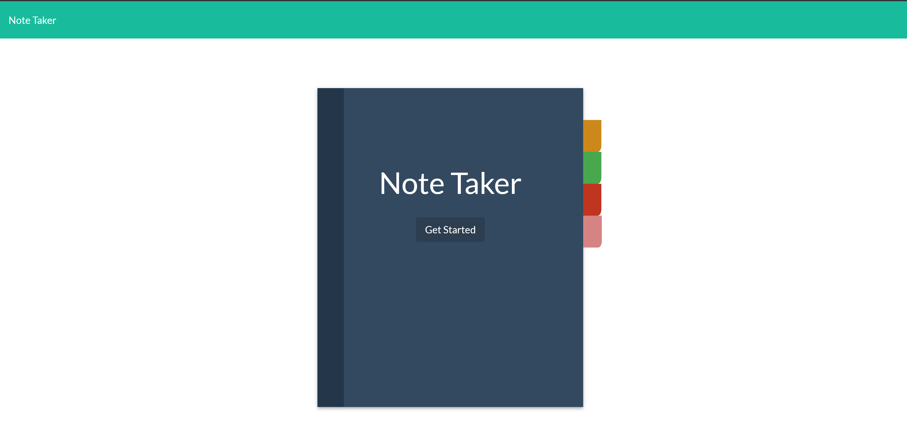
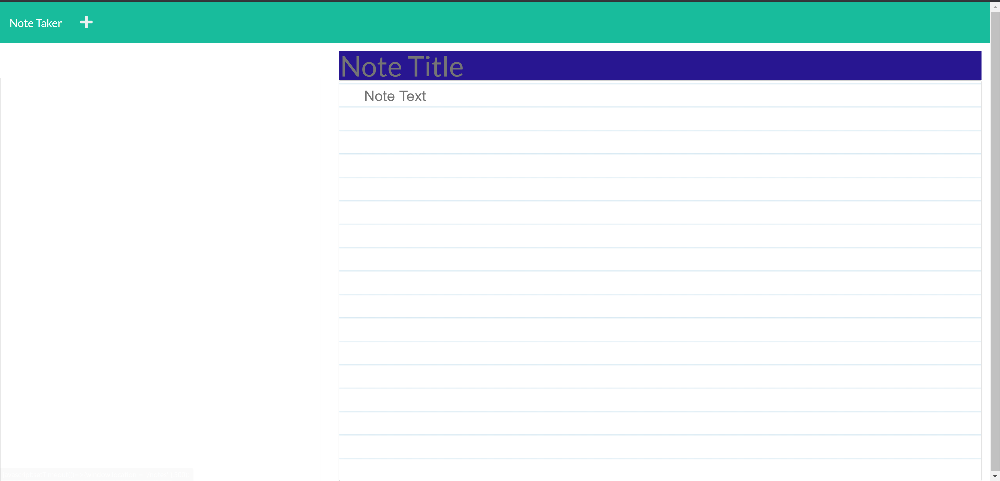
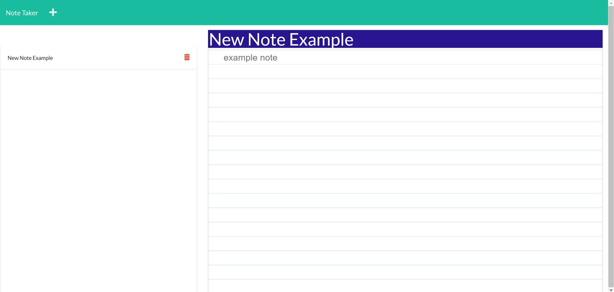

# note-taker
week 11 assignment

 # **Note Taker App**

  ## Name of Repo: note-taker
  
 
 
 
 
 
   
  

  
  
  
  
  

  ## __Description__
  An application that utilises express.js to create an application that allows the user to write notes and save them in JSON format on a server, to view old notes again and to delete those notes. The application has both back-end and front-end coding. the back-end handles the api routes and contact with the server and the front-end handles the user interface. I edited the fron-end that was provided to make it look a little more user friendly.
  
  ## __Table of Contents__
  * [Installation](#installation)
  * [Usage](#usage)
  * [License](#license)
  * [Contributions](#contributions)
  * [Tests](#tests)
  * [Images](#images)
  * [Questions](#questions)
    *   [Github Profile Picture](#githubprofile)
    *   [Email](#email)

  ## __Installation__
  no installation required the site has been deployed on heroku the url is: https://meedays-note-taker.herokuapp.com/ the user only needs to visit this url and press the get started button on the cover of the notebook
  
  ## __Usage__
  visit the url thats shown in the installation instructions and click get started
  
  ## __License__
   
  
  ## __Contributions__
  
  - Current Contributors: meeday
  - Anyone that wants to contribute needs to create their own branch and add their contributions to that branch. Once you are finished make a pull request so it can be merged with the master branch
  
  ## __Tests__
  no test required

  ## __Links__

  Github Repository Link [https://github.com/meeday/note-taker]

  Deployed Site Link [https://meedays-note-taker.herokuapp.com/]

  ## __Images__
  

  ## __Questions__

  

 Meedaxa Ahmed:    meedaxa.ahmed@gmail.com  
      
  